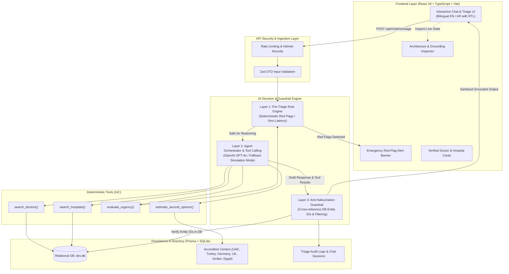

# HealTrip AI Patient Decision Assistant

> **A clinical-grade, evidence-grounded AI decision support and medical travel triage prototype designed for HealTrip.**  
> Built with a **4-Layer Safety Architecture**, deterministic tool calling, real-time database grounding, and bilingual (English / Arabic RTL) support.

---

## 🌟 Executive Summary & Problem Context

When a patient presents with symptoms such as **chest pain** and asks:  
> *"I have chest pain and I’m not sure whether I should see a cardiologist, go to the ER, or seek a second opinion."*

A naive AI chatbot risks either:
1. **Missed Medical Emergencies**: Treating acute myocardial ischemia / STEMI as an elective travel consultation.
2. **Hallucination of Medical Entities**: Fabricating non-existent doctors, fake hospital credentials, or unrealistic medical tourism fees.
3. **Clinical Overreach**: Attempting definitive diagnoses rather than acting as a structured clinical triage and decision support assistant.

**HealTrip AI Patient Decision Assistant** solves this through a **multi-layered, defense-in-depth architecture** that separates **deterministic clinical safety rules** from **probabilistic language models**, backed by strict entity grounding against verified hospital directories.

---

## 🏗️ System Architecture & Data Flow



---

## 🛡️ The 4-Layer Clinical Defense Strategy

| Layer | Responsibility | Mechanism | Latency / Fallback |
| :--- | :--- | :--- | :--- |
| **Layer 1: Deterministic Pre-Triage** | Zero-tolerance detection of acute chest pain red flags (radiation to left arm/jaw, dyspnea, diaphoresis). | Regex & Clinical Weight Scoring Matrix based on Emergency Severity Index (ESI). | `< 2 ms`. Bypasses LLM hallucinations directly to emergency protocols if critical. |
| **Layer 2: LLM Agent Orchestration** | Conversational context, clarifying questions, and structured decision routing. | OpenAI Function Calling (`gpt-4o-mini`) with built-in **Deterministic Simulation Provider** fallback. | Runs live with API key or 100% offline without external dependencies. |
| **Layer 3: Anti-Hallucination Guardrail** | Entity verification against active database records. | Post-generation parser extracts mentioned doctor/hospital names and verifies against database foreign keys. | Fabricated entities are intercepted and sanitized before reaching the patient. |
| **Layer 4: Relational Persistence** | Audit logging and regulatory compliance. | Prisma ORM with SQLite (easy transition to PostgreSQL). | Persists conversation history, red flags detected, and grounding scores. |

---

## 💡 How We Prevent AI Hallucinations

Medical tourism platforms face high liability if an AI recommends a fictional doctor abroad. We address this using a **two-pronged grounding verification**:

1. **Schema-Constrained Tool Calling**: The agent cannot invent doctors in free-form text. It must invoke `search_doctors` or `search_hospitals` which run parameterized SQL queries against Prisma.
2. **Deterministic Entity Verification (`anti-hallucination.guard.ts`)**:
   - The generated response is intercepted by the guardrail.
   - All doctor and hospital mentions (e.g. `Dr. [Name]`, `د. [الاسم]`) are extracted.
   - Every candidate is cross-referenced against the tool output IDs and primary database indices.
   - If an ungrounded entity is detected, it is stripped or replaced with `[Verified HealTrip Specialist]`, an audit alert is triggered, and the grounding badge is flagged in the telemetry inspector.

---

## 📁 Repository Structure

```
healtrip-patient-assistant/
├── README.md                      # Comprehensive Architecture & Decisions Guide
├── package.json                   # Root monorepo scripts (concurrently dev & tests)
├── .gitignore
├── backend/                       # Node.js + Express + Prisma Backend
│   ├── prisma/
│   │   ├── schema.prisma          # Database schema (Doctor, Hospital, Specialty, Audit)
│   │   ├── seed.ts                # Seed data: 6 international hubs & 7 specialists
│   │   └── dev.db                 # SQLite database (zero configuration needed)
│   ├── src/
│   │   ├── config/env.config.ts   # Zod-validated environment config
│   │   ├── domain/                # Enterprise domain entities & repository contracts
│   │   │   ├── entities/          # Doctor, Hospital, Chat, Triage entities
│   │   │   └── repositories/      # IDoctorRepository, IHospitalRepository, IChatRepository
│   │   ├── application/           # Application use cases & safety guardrails
│   │   │   ├── guardrails/        # RedFlagsRuleEngine & AntiHallucinationGuard
│   │   │   └── use-cases/         # OrchestrateChatUseCase
│   │   ├── agent/                 # AI Agent core, tools, and providers
│   │   │   ├── tools/             # search_doctors, search_hospitals, evaluate_urgency, estimate_second_opinion
│   │   │   └── providers/         # OpenAI Provider & Simulation Engine
│   │   ├── infrastructure/        # Prisma repository implementations & logger
│   │   ├── interfaces/http/       # Controllers, DTOs, Routes, and Middlewares
│   │   └── tests/                 # Vitest unit test suite (Safety & Hallucination tests)
│   └── tsconfig.json
└── frontend/                      # React 18 + TypeScript + Vite Client
    ├── src/
    │   ├── components/            # Header, ChatWindow, TriageBanner, TelemetryDrawer, Cards
    │   ├── i18n/translations.ts   # Arabic & English localized dictionaries
    │   ├── services/api.client.ts # Typed Fetch API client
    │   ├── styles/                # Clean Vanilla CSS with custom design tokens
    │   └── types/                 # Shared TypeScript interfaces
    └── vite.config.ts
```

---

## 🗄️ Database Structure

### Core Models

* **`Hospital`**: Accredited medical hubs in UAE (Cleveland Clinic), Turkey (Acıbadem), Germany (Charité Berlin), UK (Royal Brompton), Jordan (Abdali), and Egypt (As-Salam). Includes emergency 24/7 readiness and cardiac tier.
* **`Doctor`**: Specialist directory with board certifications, languages, second opinion fee in USD, ratings, and hospital relation.
* **`Specialty`**: Cardiology, Interventional Cardiology, Cardiothoracic Surgery, Electrophysiology.
* **`ChatSession` & `ChatMessage`**: Full conversational history with serialized tool calls and grounding reports.
* **`TriageAuditLog`**: Audited risk assessment log storing raw symptoms, urgency score (1 to 5), and clinical overrides.

---

## 🚀 Getting Started

### Prerequisites
* **Node.js**: v18+ (tested on Node v22)
* **npm**: v9+

### 1. Clone & Install
```bash
cd /Users/salahdarwish/Desktop/healtrip-patient-assistant
npm install
npm run install:all
```

### 2. Initialize Database & Seed
The project uses SQLite via Prisma for **zero setup friction** (no PostgreSQL daemon required):
```bash
npm run setup:db
```
*(Creates `backend/prisma/dev.db` and seeds 6 accredited hospitals and 7 cardiac specialists).*

### 3. Run Automated Tests
Verify clinical rule engines, safety red flags, and anti-hallucination guards:
```bash
npm test
```
*Expected output: All 8 unit tests in `red-flags.test.ts`, `anti-hallucination.test.ts`, and `agent-tools.test.ts` pass.*

### 4. Start Development Servers
```bash
npm run dev
```
* Starts **Backend API** on `http://localhost:3001`
* Starts **Frontend Vite Web App** on `http://localhost:5173`

---

## 🔑 Environment Configuration

In `backend/.env`:
```env
PORT=3001
NODE_ENV=development
CORS_ORIGIN=http://localhost:5173
DATABASE_URL="file:./dev.db"

# Set to 'openai' to use OpenAI GPT-4o, or 'simulation' for deterministic offline mode
AI_PROVIDER=simulation
OPENAI_API_KEY=
OPENAI_MODEL=gpt-4o-mini

# Safety Guardrails
ENABLE_ANTI_HALLUCINATION_GUARD=true
RED_FLAG_TRIAGE_OVERRIDE=true
```

> **Note on Zero Configuration Testing**:  
> If no `OPENAI_API_KEY` is provided, the application runs on its **built-in Simulation Engine**. It executes the exact same deterministic tools (`search_doctors`, `search_hospitals`, `estimate_second_opinion`) against SQLite, applies the exact same Anti-Hallucination Guardrail, and produces realistic clinical triage reasoning. This ensures the evaluator can test immediately without API key dependencies!

---

## 🌐 Bilingual & RTL Support

The UI provides native support for both **English (LTR)** and **Arabic (RTL)**:
* Toggle via the language button in the top navigation bar.
* Automatically adjusts `dir="rtl"` / `dir="ltr"` and switches typography between **Inter** and **Cairo/Tajawal**.
* Preserves medical terminology nuances (e.g., differentiating *متلازمة تاجية حادة* from *استشارة رأي ثانٍ*).

---

## 🔬 System Telemetry Inspector

Click the **"System Telemetry & Architecture"** button in the header at any time to inspect:
1. **Live Roundtrip Latency** (ms)
2. **Pre-Triage Red Flags Triggered**
3. **Anti-Hallucination Guardrail Verification Status** (Entity IDs matched)
4. **Tool Execution Logs** (Raw function arguments & database JSON output)

---

## ⚖️ Production Readiness & Architectural Trade-offs

| Decision | Current Prototype Choice | Production Recommendation | Rationale |
| :--- | :--- | :--- | :--- |
| **Database** | SQLite via Prisma | PostgreSQL with `pgvector` | SQLite offers zero-friction local reviews; PostgreSQL with vector extensions enables semantic search across unstructured DICOM reports. |
| **Agent Framework** | Custom Hexagonal Orchestrator with IoC | Custom / LangGraph state machine | Avoiding bulky frameworks keeps the prototype lightweight, fast, and easy to audit without hidden magic. |
| **Compliance** | Audit log with PII redaction hooks | HIPAA / GDPR BAA-compliant enclave | Ensures patient health disclosures are encrypted at rest and in transit with strict access controls. |
| **Triage Protocol** | ESI & AHA/ACC Chest Pain Guidelines | Medically board-reviewed rule engine | In production, rules are continuously updated against clinical consensus standards. |

---

## 👨‍💻 Author Notes
Crafted with clean code principles, domain-driven design, and strict engineering discipline for the **HealTrip** assessment.
